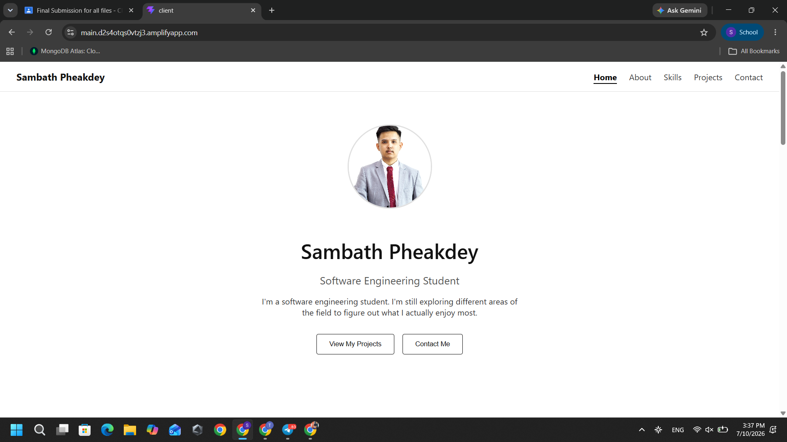
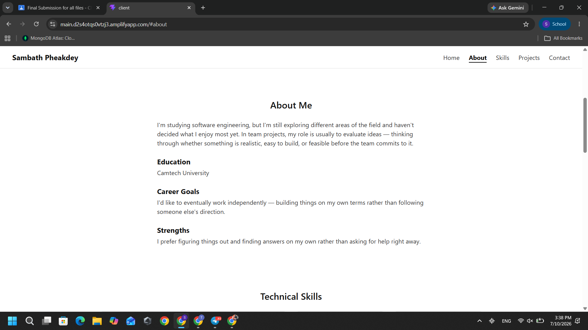
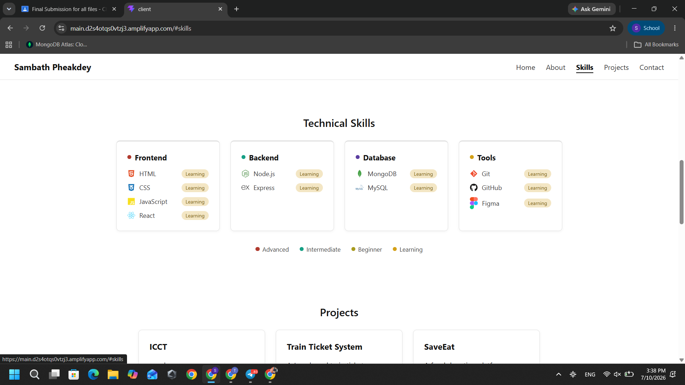
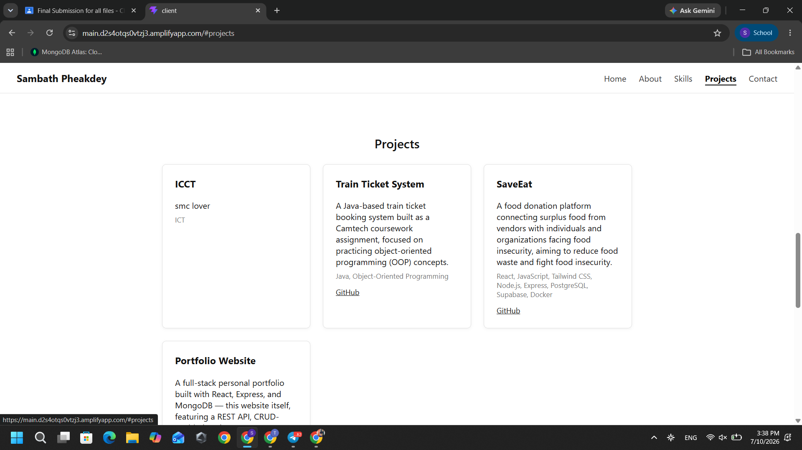
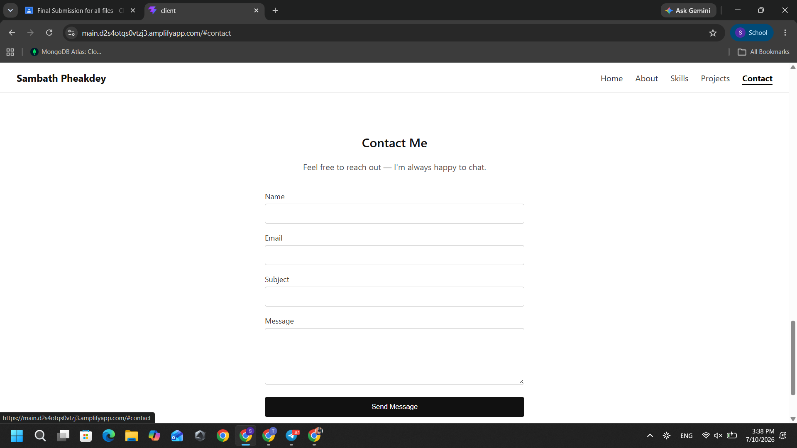
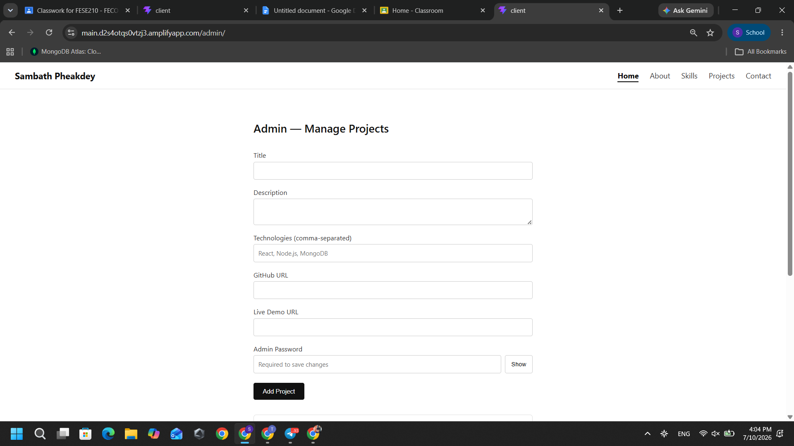
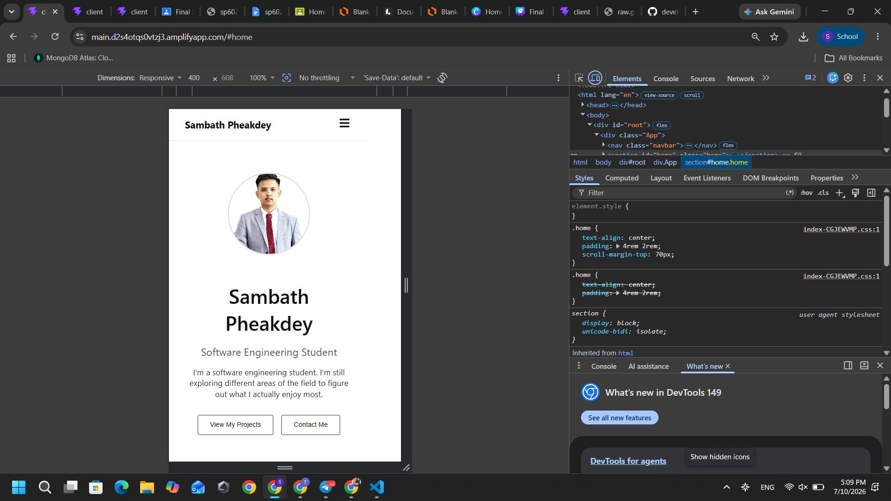

# My Professional Portfolio Website

## 1. Project Overview

This is a full-stack personal portfolio website built for my Web Development Final Assessment. It presents me as a software engineering student, showcasing my skills, projects, and background, with a working contact system so visitors can reach out to me directly.

The project is a genuine full-stack application — not a static template — with a React frontend, an Express REST API backend, and a MongoDB database, all deployed live on AWS.

## 2. Main Features

- **Home, About, Skills, Projects, and Contact pages**, each with real content
- **Projects are fully dynamic** — pulled live from MongoDB through a REST API, not hardcoded
- **Full CRUD admin panel** (`/admin`) to add, edit, and delete projects, protected by a password
- **Contact form** with client-side and server-side validation, saving messages directly to MongoDB
- **Admin messages panel** (`/admin/messages`) to privately view contact form submissions
- **Fully responsive design** — works on desktop, tablet, and mobile
- **Custom 404 page** for invalid URLs
- **Minimalist black/white/gray design**, following a clean, professional aesthetic

## 3. Technologies Used

**Frontend**
- React (Vite)
- React Router
- Axios
- React Icons

**Backend**
- Node.js
- Express.js

**Database**
- MongoDB Atlas
- Mongoose

**Deployment**
- Frontend: AWS Amplify
- Backend: AWS Elastic Beanstalk
- HTTPS backend routing: Amazon CloudFront
- Database: MongoDB Atlas (cloud-hosted)

## 4. Application Architecture

```
Visitor's Browser
      │
      ▼
AWS Amplify (React frontend, HTTPS)
      │  API requests
      ▼
Amazon CloudFront (HTTPS → HTTP proxy)
      │
      ▼
AWS Elastic Beanstalk (Express REST API)
      │
      ▼
MongoDB Atlas (cloud database)
```

The frontend and backend are two separate applications that communicate entirely through a REST API — the frontend never talks to the database directly.

## 5. Installation Instructions

1. Clone the repository:
   ```
   git clone https://github.com/developsb/Portfolio-project.git
   cd Portfolio-project
   ```
2. Install dependencies for both frontend and backend (see sections 8 and 9 below).

## 6. Environment Variable Instructions

The backend requires a `.env` file inside the `server` folder (this file is not included in the repository for security reasons). Create `server/.env` with the following keys:

```
PORT=5000
MONGO_URI=your_mongodb_connection_string
ADMIN_KEY=your_chosen_admin_password
CLIENT_URL=your_frontend_url (only needed in production)
```

No real secret values are included in this README or committed to the repository.

## 7. Running the Frontend

```
cd client
npm install
npm run dev
```

The frontend will run at `http://localhost:5173`.

## 8. Running the Backend

```
cd server
npm install
node server.js
```

The backend will run at `http://localhost:5000`.

**Note:** both the frontend and backend must be running at the same time, in two separate terminals, for the site to work correctly locally.

## 9. API Endpoint Summary

**Projects**
| Method | Endpoint | Description |
|---|---|---|
| GET | /api/projects | Get all projects |
| GET | /api/projects/:id | Get one project |
| POST | /api/projects | Create a project (admin only) |
| PUT | /api/projects/:id | Update a project (admin only) |
| DELETE | /api/projects/:id | Delete a project (admin only) |

**Messages**
| Method | Endpoint | Description |
|---|---|---|
| POST | /api/messages | Submit a contact message (public) |
| GET | /api/messages | View all messages (admin only) |

Admin-only routes require an `x-admin-key` header matching the server's `ADMIN_KEY`.

## 10. Screenshots

### Home Page


### About Page


### Skills Page


### Projects Page


### Contact Page


### Admin Panel


### Mobile View


## 11. Live Website URL

https://main.d2s4otqs0vtzj3.amplifyapp.com

## 12. GitHub Repository URL

https://github.com/developsb/Portfolio-project

## 13. Known Limitations

- The admin panel uses a simple shared password rather than full user authentication.
- No image upload feature — project images are not currently included.
- Live Demo links are not yet available for the featured projects.

## 14. Future Improvements

- Add JWT-based authentication for the admin panel
- Add image upload support for projects
- Add a dark mode toggle
- Deploy featured projects with live demo links

## 15. Author Information

**Name:** Sambath Pheakdey
**University:** Camtech University
**Program:** Software Engineering

**Contact:**
- Telegram: [@SambathPK](https://t.me/SambathPK)
- Email: sp6025010081@camtech.edu.kh
- GitHub: [developsb](https://github.com/developsb)